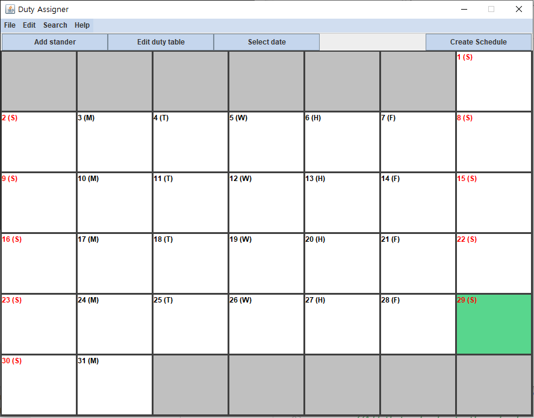

# Calendar GUI
 
Calendar interface for users and code examples.

> A calendar set is based on Georgian group calendar

## Current GUI result

## JAVA Version

Java17

## What does this do?
A demo for calendar UI with navigation system on mouse scrolls with hover-coloring feature.
The core contents are not completed.

## What was the goal for this app?
It was meant to assist administrative work to assign duty shifting schedules.
Unfortunately, this work will not be continued unless necessary.

## Regular user setup

Only for Windows for batch execution. Other Operating System requires manual command execution.

- Simply execute `Run.bat` file with `Run As Administrator` .
  Follow instructions from batch file. This batch will download and install jdk 17 and setup the environment variables if not set.

- If you wish to set up by your own, please install jdk17+ and have it set as environment variable. Then run following command at the root of the downloaded file.
  `java -jar CalendarUI.jar`
